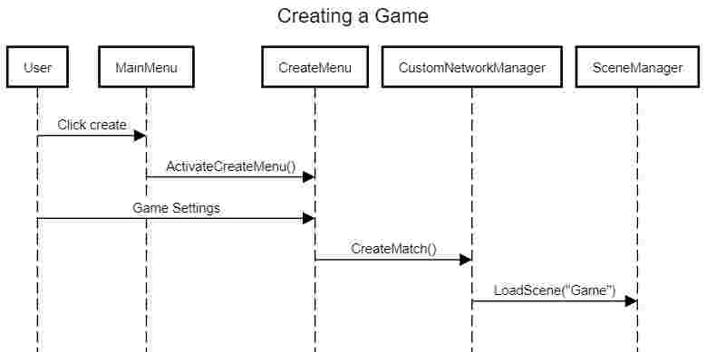
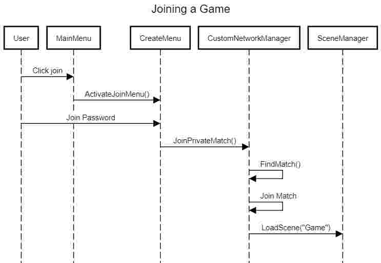
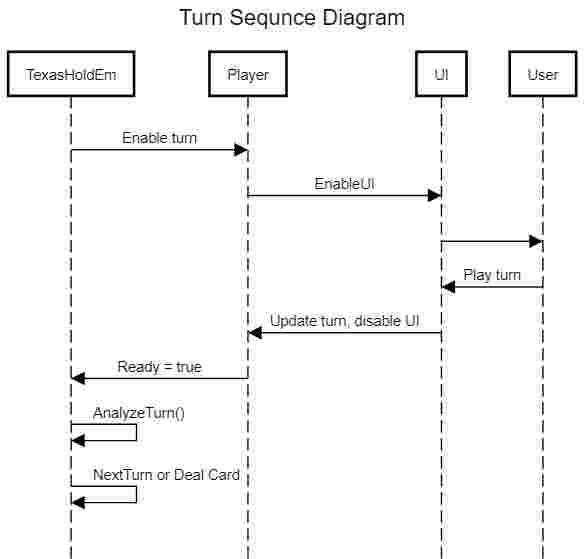
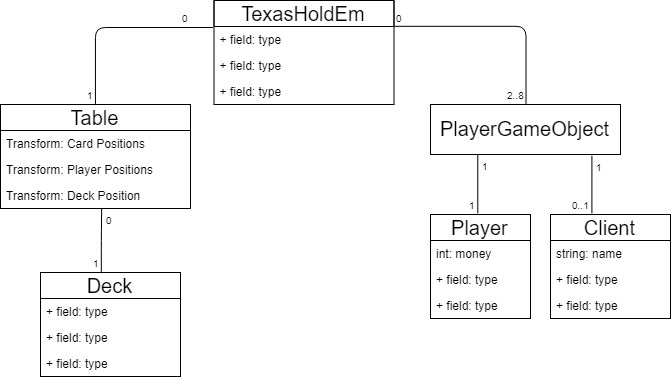

# Arkkitehtuurikuvaus

## Rakenne

## Päätoiminnallisuudet

Pelin päätoiminnallisuuksiin kuuluu pelin luonti, peliin liittyminen sekä yksittäisen vuoron pelaaminen.

Pelin luonti tapahtuu seuraavasti:

Vastaavasti pelin liittyminen tapahtuu näin:

Molempien kaavioiden lopussa CusotmNetworkManager:ista taaksepäin ei lähde minkään laista tietoa, sillä LoadScene() poistaa kaiken scenen sisällön paitsi CustomNetworkManager:in.

Vuoron pelaaminen:

Lopussa kuitenkaan Player ei kerro TexasHoldEm:illä, että se on valmis vaan TexasHoldEm odottaa loopissa, kunnes pelaaja on valmis.

## Käyttöliittymä

## Sovelluslogiikka

Luokkakaavio

