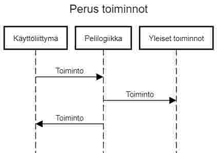
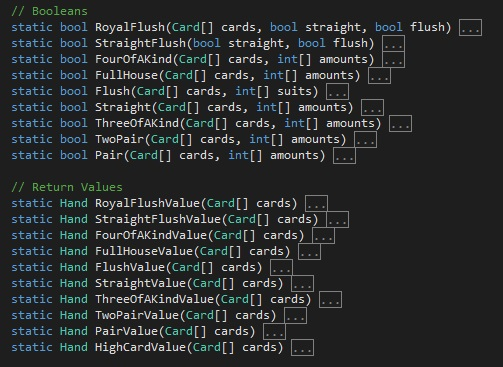

# Arkkitehtuurikuvaus

## Rakenne

Sovelluksen luokat voi jakaa kolmeen kategoriaan: pelilogiikka, käyttöliittymä ja yleiset toiminnot (kuten kortin liikuttaminen pöydällä) ja yleisesti sovelluksen rakenne noudattaa seuravaa sekvenssikaaviota:

UI kertoo pelilogiikalle, mitä tehdään. Pelilogiikka kertoo yleisille toiminnoille mitä tehdään (esim. tuhotaan kaikki kortti peliobjecktit.) Peli logiikka päivittää UI:ta tilanteesta riippuen. Poikkeuksia on myös ja esim. pelilogiikkaan kuuluvat luokat ovat jatkuvasti vuorovaikutuksessa toisiinsa ilman UI.ta välikätenä.

## Päätoiminnallisuudet

Pelin päätoiminnallisuuksiin kuuluu pelin luonti, peliin liittyminen sekä yksittäisen vuoron pelaaminen.

Pelin luonti tapahtuu seuraavasti:

Vastaavasti pelin liittyminen tapahtuu näin:

Molempien kaavioiden lopussa CusotmNetworkManager:ista taaksepäin ei lähde minkään laista tietoa, sillä LoadScene() poistaa kaiken scenen sisällön paitsi CustomNetworkManager:in.

Vuoron pelaaminen:

Vuoron pelaaminen tapahtuu tässä järjestyksessä:
- TexasHoldEm asettaa jollekin pelaajalle vuoron, player.EnblePlayerTurn(true, payUpRound)
- Pelaaja pelaa vuoronsa UI:n avulla
- UI kertoo Player luokalle mitä pelaaja haluaa tehdä
- Player luokka pelaa vuoronsa ja asettaa muuttuja Ready = true
- TexasHoldEm huomaa, että pelaaja on valmis, AnalyzeTurn(), player.EnblePlayerTurn(false, false)
- TexasHoldEm asettaa seuravaalle pelaajalle vuoron tai jatkaa pelin kulkua eteenpäin

Tästä vielä sekvenssikaavio:

Lopussa kuitenkaan Player ei kerro TexasHoldEm:illä, että se on valmis vaan TexasHoldEm odottaa loopissa, kunnes pelaaja on valmis.

### Hand luokka ja voittajan valinta
Hand luokkaa käytetään pelaajan parhaan käden valitsemiseen sekä pelaajien käsien vertailuun.

TexasHoldEm:in metodi SettleWins() valitsee voittajan/voittajan ja jakaa heille oikean määrän rahaa kierroksen lopuksi.

## Käyttöliittymä

## Sovelluslogiikka

Luokkakaavio

