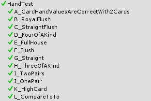

## Multiplayer ja testit
Koska peli on ainoastaan online moninpeli, tuli testauksen kanssa ongelmia ja se on jäänyt kriittisen vähiin. En ole löytänyt tapaa kuinka testata online toiminnallisuuksia, muuten kuin manuaalisesti. Myöskään Unityssä ei ole sisään rakennettuja tapoja, joilla multiplayeriä voisi testata automaattisesti. Jos olisin tajunnut tämän aikasemmin en olisi missään nimessä tehnyt Unity peliä, tai ainakaan moninpeliä tukevaa sovellusta.

Tämän takia esimerkiksi pääpelilogiikalle ja serverin aloittamiselle/liittymiselle ei ole omia testejä.

### Testejä

Pelaajien parhaan käden valitsemista testaa testiluokka HandTest.cs. Siinä on testit 2 kortin kädelle, sekä erikseen kaikille eri käsille kuningasvärisuorasta haikorttiin sekä 5:llä, että 7 kortilla. Logiikka on sama, sekä 6, että 7 kortilla joten 6 ei tarvitse erikseen testata. Testi testaa myös CompareTo ja Equals metodia. Koska Player luokan CompareTo metodi palauttaa luokan Hand CompareTo arvon, tulee samalla testattua voittajan valinta, joka perustuu taulukon järjestämiseen valmiilla Arrays.Sort() metodilla.

Korttipakkaa testataan DeckTest.cs luokalla. Tämä testaa onko pakassa aluksi kaikki 52 korttia ja onko käikki kortit pakassa vielä sekoituksen jälkeen.

Tools luokka sisältää useita laajasti projektissa käytettyjä metodeita, kuten käyttäjän syöttee muuttaminen rahamääräksi ja rahamäärän muuttaminen stringiksi. Näitä testaa ToolsTest.cs.

### Manuaaliset testit multiplayeriin

Näitä seuraavia asioita olen testannut multiplayerissa maanuaalisesti:

- Serverin voi aloittaa
- Serveriin voi liittyä
- Serveriin voi asettaa salasanan ja salasanalla liittyminen toimii
- Serveriin voi asettaa buy inin, eikä buy iniä alle 2 hyväksytä. 
- Serveriin ei voi liittyä sen jälkeen kuin peli on alkanut
- Pelissä voi asettaa oman nimen ja muut pelaajat näkevät sen
- Pelaaja saa oikeen määrän rahaa pelin aluksi
- Pelaaja ei voi panostaa enemmän kuin hänellä on rahaa
- Pelaaja ei voi pelata kierroksella foldauksen jälkeen
- Voiton jako tapahtuu oikein, riippumatta siitä onko kyseessä tasapeli tilanne
- Pelaaja postetaan pelistä jos hänellä ei ole rahaa
- Kaikki UI elementit paitsi scoreboard (jos on tyhjiä pelaajia) päivittyy oikein
- Peli päättyy oikein ja pelaajat palautetaa päävalikkoon ilman, että peli kaatuu
- Pelin päättyessä ilmenee virheitä networkingissä, mutta nämä virheet eivät vaikuta ohjelman toimintaan
